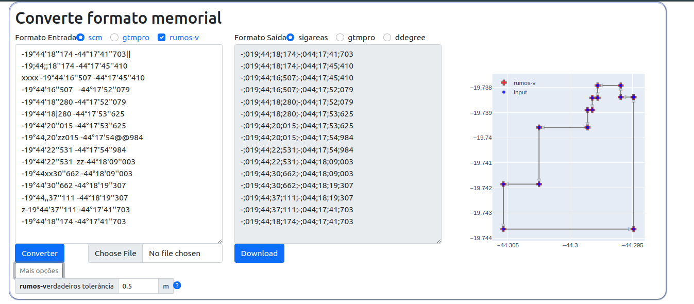

# Careas Apps - Conversor de Memorial

Ferramenta web para conversao de coordenadas de memorial descritivo para sistemas da ANM (SIGAREAS).



## Funcionalidades

- Conversao entre formatos: SCM <-> GTMPro <-> SIGAREAS <-> Decimal
- Ajuste automatico para rumos verdadeiros (N/S/E/W)
- Visualizacao do poligono com estatisticas (vertices, area, perimetro)
- Upload de arquivo ou input manual

## Stack

- **Frontend**: React 19 + Vite + Tailwind CSS + shadcn/ui + Plotly.js
- **Backend**: Flask + poligonal (aidbag)

## Desenvolvimento Local

```bash
# Instalar dependencias
cd frontend && npm install
pip install -r backend/requirements.txt
pip install git+https://github.com/eusoubrasileiro/aidbag.git

# Rodar
cd frontend && npm run dev      # http://localhost:5173
cd backend && python main.py -d # http://localhost:5000
```

## Deploy

**URL**: https://gis.anm.amiticia.cc (Docker + Portainer)

```bash
docker compose up -d
```

## Documentacao Tecnica

Ver [CLAUDE.md](CLAUDE.md) para detalhes de implementacao.
